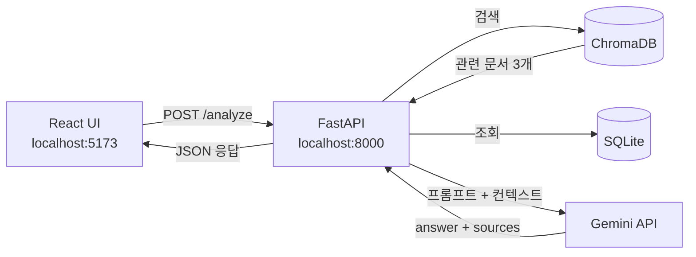

# CareerFit AI
취업·공모전 데이터 기반 맞춤형 AI 포트폴리오 코치

## 📋 프로젝트 개요
취업 공고 및 공모전 정보를 시맨틱 RAG 검색으로 분석하여 구직자의 역량과 매칭하고 맞춤형 포트폴리오 개선을 돕는 AI 코치 서비스

---------

## ✨ 주요 기능
- RAG 기반 역량 분석: 취업 공고 데이터를 근거로 맞춤형 조언 제공
- 출처 표시: 어떤 공고 데이터를 참고했는지 sources로 함께 반환
- Mock Mode: API 한도 초과 시 MOCK_MODE=true 로 폴백 가능

---------


## 🛠️ 기술 스택
| 영역 | 기술 |
|---|---|
| 백엔드 | 	  |
| AI API | Gemini 2.5 Flash-Lite |
| 데이터 |    |
| 프론트엔드 |    |
| 실행 환경 |   |

---------

## 📁 Project Structure
```text
CareerFit_AI/
├── backend/                # FastAPI 기반 API 서버
│   ├── data/               # SQLite 및 ChromaDB 벡터 데이터
│   ├── routers/            # API 엔드포인트 정의 (health, jobs, analyze)
│   ├── services/           # AI 비즈니스 로직 및 RAG 파이프라인
│   ├── main.py             # 백엔드 진입점
│   └── requirements.txt    # 백엔드 의존성 설정 파일
├── frontend/               # React/Vite 기반 사용자 인터페이스
│   └── src/                # 프론트엔드 소스 코드
│   │   ├── components/     # 화면 구성 컴포넌트 (InputForm, ResultCard, SourceCard)
│   │   ├── App.jsx         # 프론트엔드 메인 로직 및 API 연동
│   │   └── index.css       # 글로벌 스타일 및 테마 변수 정의
│   └── tailwind.config.js  # Tailwind CSS 설정
└── docs/                   # 설계 문서 및 평가 가이드라인
```

---------

## 🏗️ Architecture


------


## 🌐 API (API Endpoints)
백엔드 서버 실행 후 `http://localhost:8000/docs` 에서 Swagger 문서를 확인할 수 있습니다.

| Method | Endpoint | Description |
|---|---|---|
| **GET** | /health | 서버 상태 확인 |
| **GET** | /jobs | 데이터베이스에 등록된 전체 공고 목록 조회 |
| **POST** | /analyze | RAG 검색 기반 AI 역량 진단 및 맞춤 포트폴리오 분석 피드백 |


------
## 🚀 실행 방법
### Git Clone
```bash
git clone https://github.com/ottermere21/CareerFit_AI.git
cd CareerFit_AI
```

### 1️⃣ Docker 이용 실행 (권장)
**1. Docker 설치 확인**
Docker Desktop이 설치되어 있는지 확인합니다.
설치되어 있지 않은 경우 [Docker Desktop](https://www.docker.com/products/docker-desktop/)에서 설치할 수 있습니다.
```bash
# version 26.x.x 이상이면 정상
docker --version
```

**2. Docker Image 빌드**
```bash
docker build -t careerfit-ai ./backend
```

**3. Docker Container 실행**
```bash
docker run -p 8000:8000 --env-file backend/.env careerfit-ai
```

### 2️⃣ 로컬 실행
#### 1. Backend Setup & 실행
**1-1. 가상환경 생성 및 활성화**
데이터 전처리 및 백엔드 구동을 위해 가상환경을 만들고 의존성 패키지를 먼저 설치해야 합니다.
```bash
cd backend

# MacOS
python3 -m venv venv
source venv/bin/activate  
# Windows
python -m venv venv
venv\Scripts\activate
```

**1-2. 의존성 패키지 설치**
```bash
pip install -r requirements.txt
```

**1-3. 환경변수 설정**
`.env.example` 파일을 복사하여 `.env` 파일을 만들고 API Key를 입력합니다.
 *주의: 보안을 위해 `.env` 파일은 절대 Git 저장소에 커밋하지 마십시오.*
```bash
cp .env.example .env
```

**1-4. 데이터 전처리 및 DB 빌드**
의존성 설치가 끝난 가상환경 상태에서 전처리 스크립트를 실행해 SQLite DB(`careerfit.db`)를 생성합니다.
```bash
# MacOS
python3 data/preprocess.py
# Windows
python data/preprocess.py
```

| 단계 | 도구 | 설명 |
|---|---|---|
| 1. 수집 | CSV | 강사 제공 목업 데이터 + 개인화 데이터 |
| 2. 전처리 | Pandas | 결측치 제거, 중복 제거, 스킬 표준화 |
| 3. 구조화 저장 | SQLite | 필터링·조회용 관계형 DB |
| 4. 벡터 저장 | ChromaDB | 의미 기반 RAG 검색용 벡터 DB |

**1-5. 백엔드 서버 실행**
준비가 끝나면 백엔드 서버를 실행합니다.

```bash
cd backend
uvicorn main:app --reload --port 8000
```

**cf. 가상환경 사용을 끝마친 경우 비활성화**
```bash
deactivate
``` 

-------

#### 2. Frontend Setup & 실행
**2-1. Vite + React 프로젝트 생성**
```bash
node -v   # 11버전 이상
npm --vm  # 9버전 
# 버전 없으면 설치 

cd frontend
npm install
```

cf. 최초 프로젝트 생성 시
```bash
cd frontend
npm create vite@latest frontend -- --template react
```
Ok to proceed? (y) y
- Target directory "frontend" is not empty - 'Ignore files and continue' 선택 
- Which linter to use? - 'ESLint' 선택
- Install with npm and start now? - 'yes' 선택

**2-2. Tailwind CSS 설치**
버전 확인 후, 다른 버전이 설치된 경우 삭제 후 다시 설치합니다.
최적 버전: v3
```bash
# 버전 확인
npm list tailwindcss
# v3가 아닌 경우 삭제
npm uninstall tailwindcss postcss autoprefixer
# 설치
npm install -D tailwindcss@3 postcss autoprefixer
# 초기화
npx tailwindcss init -p
```

**2-3. 프론트엔드 서버 실행**
준비가 끝나면 프론트엔드 서버를 실행합니다.
- 브라우저 접속 주소: http://localhost:5173

```bash
cd frontend
npm run dev
```

----------

## 🔗 Deployment
- 💡 [Frontend](https://careerfit-ai-frontend-j8yc.onrender.com) (Render 배포)
- 💡 [Backend](https://careerfit-ai-d4du.onrender.com) (Render 배포)
- **API Documents**: [https://careerfit-ai-d4du.onrender.com/docs](https://careerfit-ai-d4du.onrender.com/docs)

----------

## 🎯 RoadMap
- [x] 1일차: 프로젝트 기획 및 개발 환경 세팅
- [x] 2일차: FastAPI 서버 구축 및 Gemini API 연결
- [x] 3일차: 데이터 파이프라인 구축
- [x] 4일차: RAG 기반 서비스 + React UI
- [x] 5일차: Docker + 포트폴리오 완성

----------

## 🔮 향후 개선
- **웹 크롤러 기반 데이터 자동 업데이트**: 정적 CSV에 의존하지 않고 채용/공모전 플랫폼에서 주기적으로 데이터를 긁어와 DB를 갱신하는 스케줄러 도입
- **실제 공고 페이지 연결 및 데이터 매칭**: 추천 카드 내 실제 채용 공고 원본 페이지로 이동할 수 있는 아웃링크 연결 및 유사 성향 사용자들이 보유한 스킬 시각화
- **사용자 경험(UX) 고도화**:
  - 분석 진행률을 알 수 있는 단계별 로딩 인디케이터(Stepped Progress Indicator)
  - 전공 및 기술 스택 입력의 자동완성 태그 UI 및 편리한 체크박스 폼 제공
  - 분석 결과 리포트 다운로드(PDF, Markdown 내보내기) 기능

----------

## 👨‍💻 개발 과정


